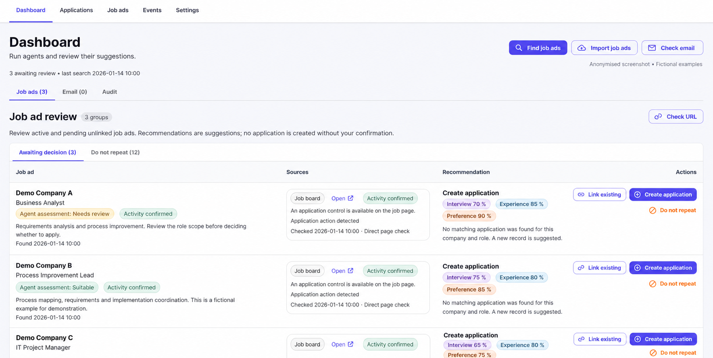

# Neringa Bateikienė

## Systems analysis and hands-on product development

I build personal applications around problems I know first-hand: managing a job search and connecting accounting with marketplace operations. My background in ERP systems, finance and e-commerce helps me define how a product should behave, including the exceptions.

I use AI coding tools to implement functionality. I define the needs, business rules and priorities, test the result, and direct the next improvement.

**[View the project presentation](presentation/README.md)** · [Download PowerPoint](presentation/Neringa_Bateikiene_Product_Portfolio.pptx?raw=true)

## Explore my projects

### [Career CRM](projects/career-crm/README.md)

**A personal workspace for finding opportunities and managing application history.**

Career CRM brings source checks, fit assessments and suggested actions into one review queue. AI helps find opportunities and interpret recruitment emails. The user confirms changes, while event rules keep application statuses and history consistent.

*Anonymised application screenshot, translated into English for presentation.*

**A decision worth exploring:** how to use AI suggestions while preserving reliable statuses and event history.

[Explore the screenshots and Career CRM case study](projects/career-crm/README.md#see-the-system)

### [NB Accounting](projects/nb-accounting/README.md)

**E-commerce bookkeeping built around rules, checklists and clear next actions.**

NB Accounting brings marketplace and payment imports into a bookkeeping workflow centred on a period checklist. Configurable rules check imported data, outstanding documents and bank balances, showing what is complete and what needs attention.

*Anonymised application screenshot with English labels and sample data.*

**A decision worth exploring:** how to make an accounting checklist reflect the underlying records, while keeping manual confirmation visible.

[Explore the screenshots and NB Accounting case study](projects/nb-accounting/README.md#see-the-system)

## My contribution

- I start with the user's problem and map the process and data relationships.
- I define states, rules, exceptions and acceptance criteria.
- I set priorities and guide implementation with AI coding tools.
- I use the applications, investigate mismatches and refine the behaviour.

Both projects use **Python, FastAPI, PostgreSQL, React, TypeScript and Docker**, with GitHub for version control.

These are personal projects under active development. This portfolio presents selected workflows and product decisions. The application repositories remain private, and the current applications run locally.

**Based in Vilnius, Lithuania.**
