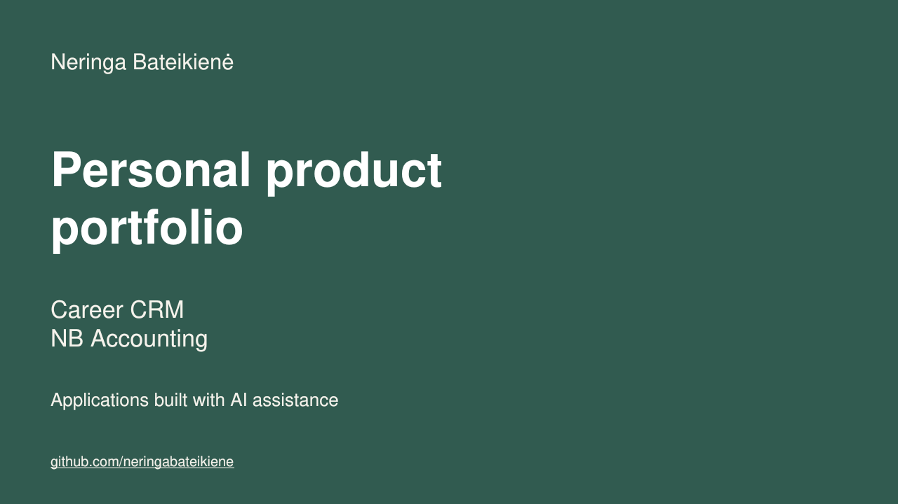
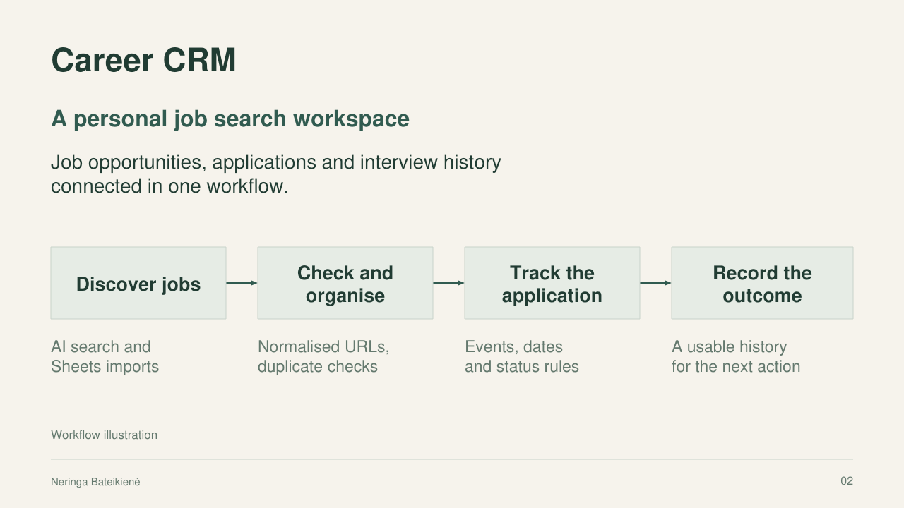
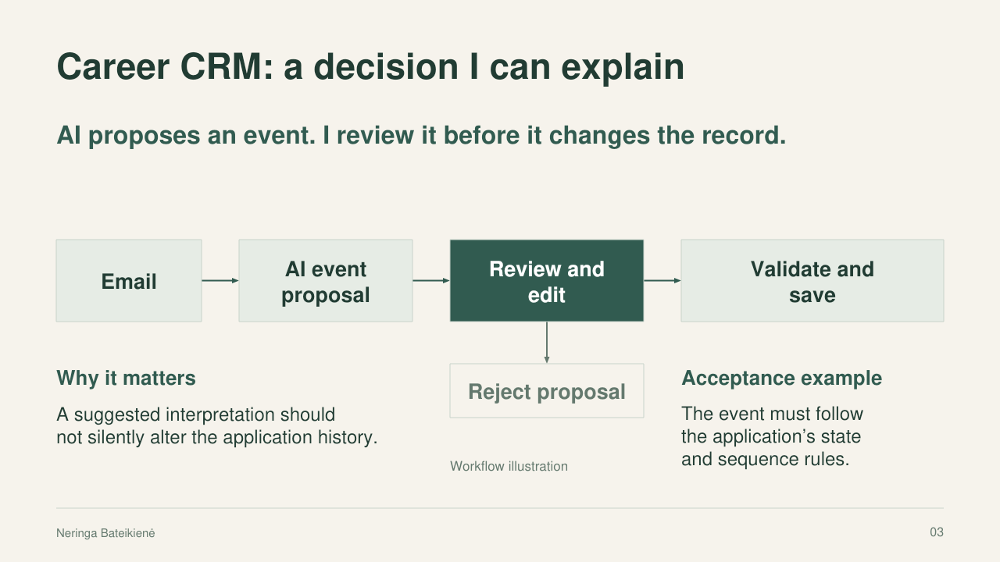
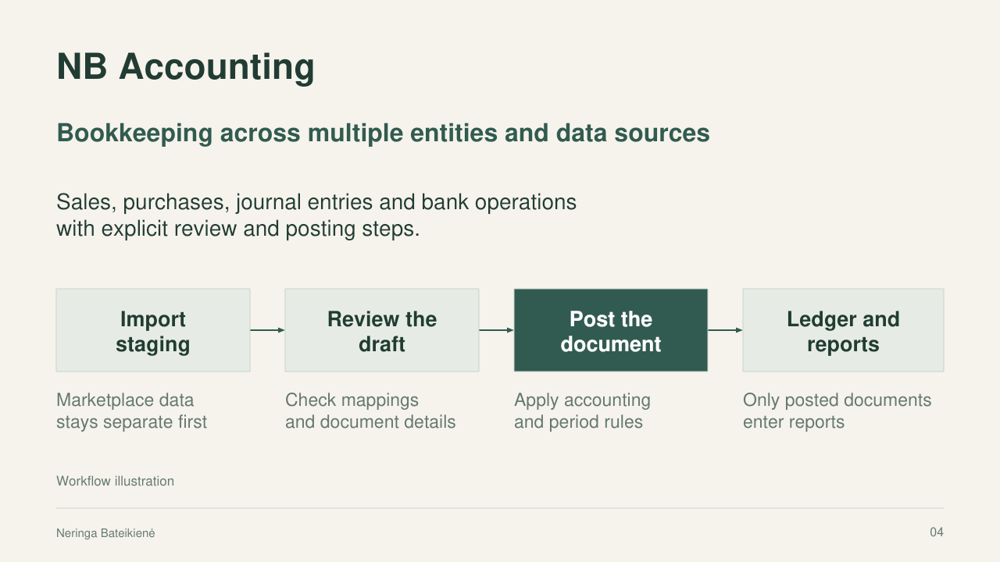
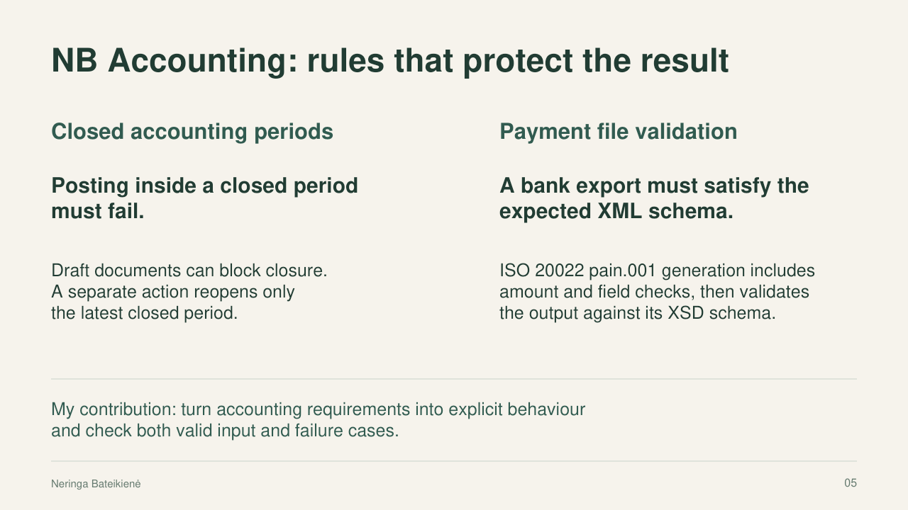
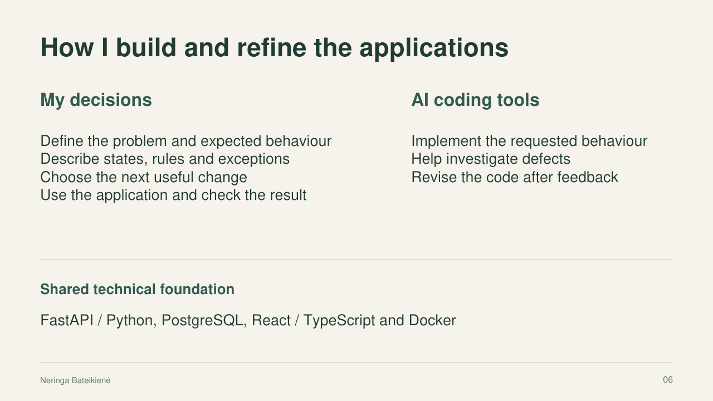
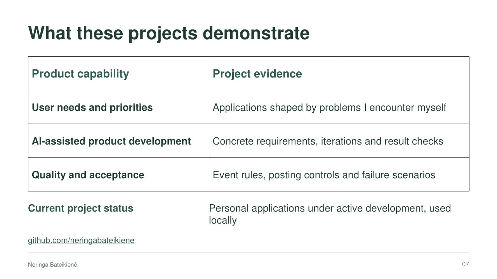

# Career CRM and NB Accounting

## Project presentation

A presentation of my personal applications, workflows and product decisions.

[Download the editable PowerPoint presentation](Neringa_Bateikiene_Product_Portfolio.pptx?raw=true) · [Back to my portfolio](../README.md)

The images below are presentation slides. Process diagrams illustrate the application workflows and are not interface screenshots.

### 1. Personal product portfolio

### 2. Career CRM

### 3. AI proposals and human review

### 4. NB Accounting

### 5. Accounting controls

### 6. My development process

### 7. What these projects demonstrate

## Read the project case studies

- [Career CRM](../projects/career-crm/README.md)
- [NB Accounting](../projects/nb-accounting/README.md)
