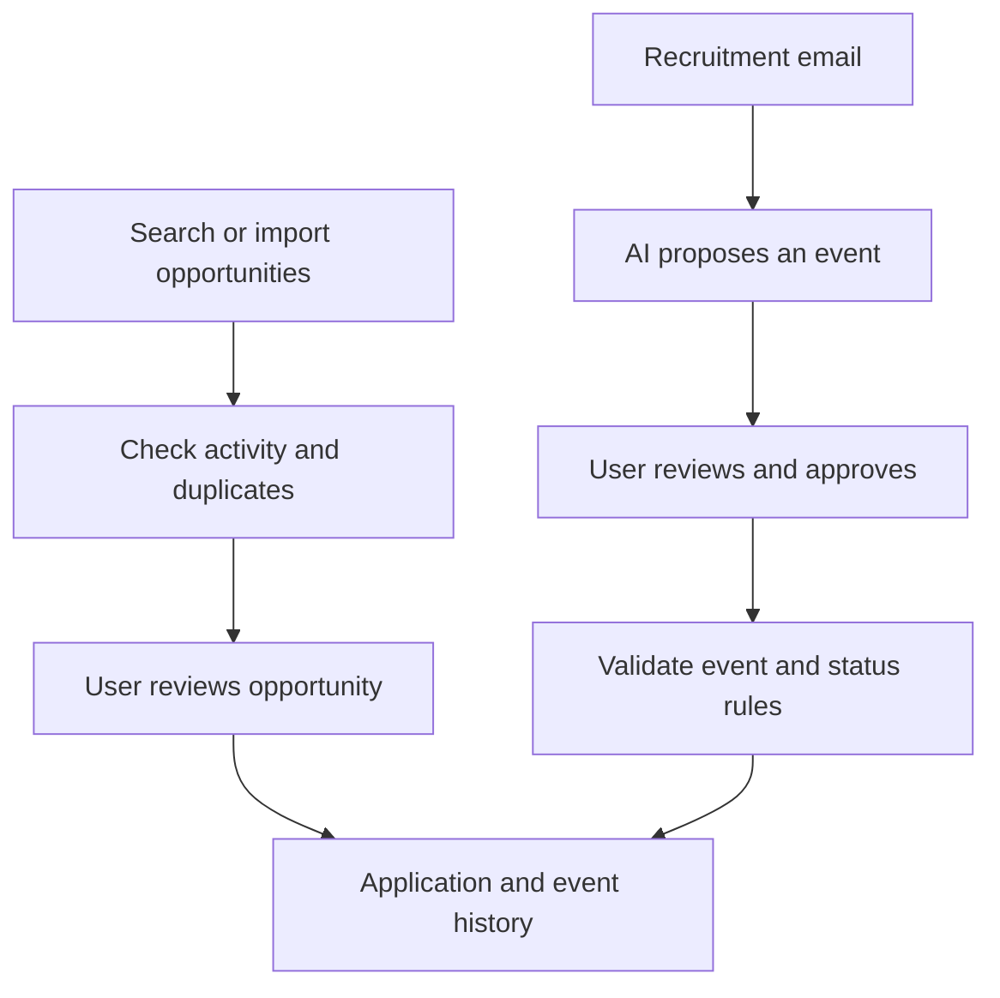

[← Back to my portfolio](../../README.md)

# Career CRM

## A personal job-search application, built around real decisions

I developed Career CRM to manage my own job search: finding opportunities, deciding which ones to pursue, keeping track of applications and following what happens next. I use the application myself and continue improving it when real situations reveal missing rules or awkward steps.

The project combines systems analysis with hands-on, AI-assisted product development. I define the requirements, data relationships, priorities and expected behaviour. AI coding tools help implement the code; I test the result, identify mismatches and request corrections. I turn a real need into a coherent application and take responsibility for how it behaves.

**Status:** Active personal application, used locally. Source code is private. This is a project presentation, not a public live service.

## The problem I wanted to solve

A job opportunity can appear on several websites, while its application history lives elsewhere: in emails, notes and a spreadsheet. A link may still open after the vacancy closes. An email may confirm an application, invite me to an interview or simply change an existing interview time.

I wanted one place to connect these pieces without confusing a job advertisement with an application, or an AI suggestion with a confirmed fact.

## What the application does

- **Finds and collects opportunities.** AI-assisted web search and Google Sheets import feed a review workflow. I can also check an individual job-ad URL.
- **Checks and deduplicates advertisements.** URL normalization and portal identifiers help recognize repeated links. Separate page checks classify activity as active, inactive or unknown.
- **Keeps applications and their history together.** An application can have several source links and a timeline of events. Event rules keep the timeline and application status consistent.
- **Turns recruitment emails into proposals.** An AI-assisted Gmail integration suggests application events. I review the application, event type, date and notes before confirming them.
- **Supports repeatable work.** Configurable schedules, run summaries and cancellation controls make recurring checks manageable.

*Workflow illustration. AI suggestions require user review before entering the application history.*

## The product decisions that matter

**Separate AI judgement from system rules.** AI helps discover opportunities and interpret messages. Deterministic logic handles link identity, activity evidence and event consistency. An inaccessible or contradictory job page remains “unknown”; uncertainty is visible rather than silently treated as success.

**Keep the user in control.** Discovering an opportunity does not automatically create an application. An email-derived proposal does not automatically become a confirmed event. Review and approval are part of the workflow, not an afterthought.

**Protect the meaning of history.** An older event should not overwrite a newer manually changed status. Several advertisements can describe the same opportunity, while distinct positions at the same company must remain distinguishable.

These decisions are more important to me than simply adding another screen. They determine whether I can trust the application during everyday use.

## Concrete acceptance examples

| Scenario | Expected behaviour implemented in the application |
|---|---|
| I import the same advertisement again | Recognize the existing normalized URL or portal identifier; do not create another advertisement. |
| I add an “Inactive” event to an application | Update its status to inactive, subject to the timeline and status-date rules. |
| AI identifies an interview invitation in an email | Prepare an editable proposal; create the event only after my confirmation. |
| A job page requires login or provides conflicting evidence | Preserve an unknown activity result instead of claiming the vacancy is active. |

## How I develop and check it

My working loop is practical: use the application, identify a problem, describe the required behaviour and exceptions, ask for an implementation, then check the result. I refine the rules when a change creates ambiguity elsewhere in the process.

The repository includes backend and frontend tests, database migrations and a GitHub Actions workflow for linting, tests, migration checks and frontend builds. These checks support development; they do not replace functional testing or establish production readiness.

**Technology:** Python, FastAPI, PostgreSQL, SQLAlchemy, Alembic, React, TypeScript, MUI, Docker Compose, an LLM API and Gmail OAuth.

## A three-minute demonstration

1. Review a prepared opportunity: its source links, activity result and suggested details.
2. Confirm an application and show its linked advertisements and event history.
3. Review an email-derived event proposal, approve it and inspect the resulting timeline and status.

For an external walkthrough, I would use fictional demonstration data, without exposing personal emails or application notes.

Career CRM shows how I connect needs, rules, implementation and feedback: building useful functionality, evaluating AI-assisted results and improving reliability through actual use.
