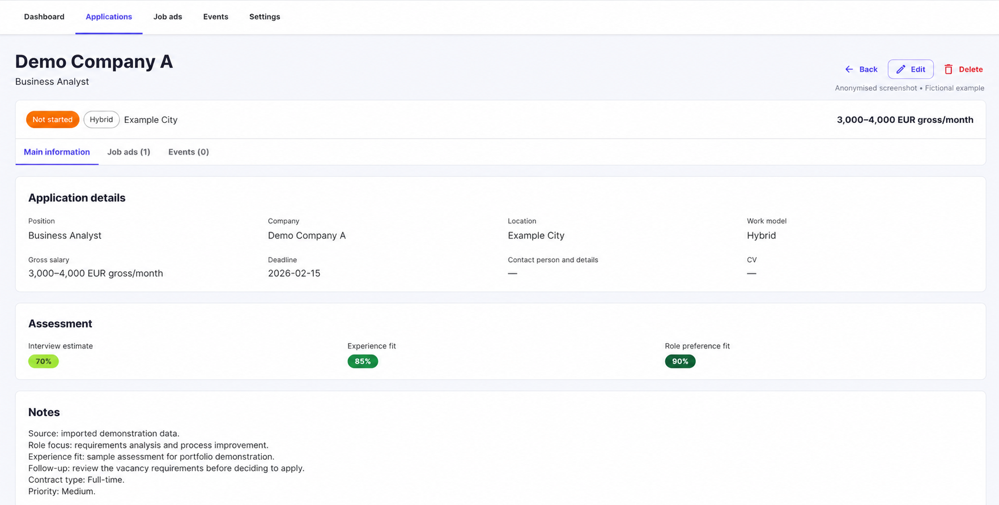
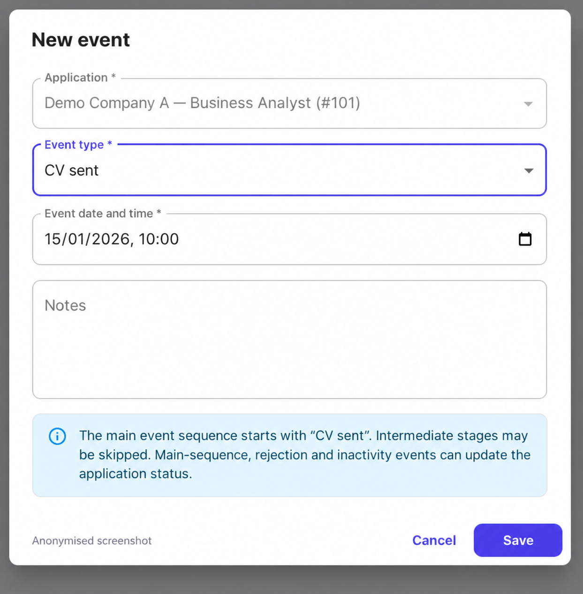

[Back to my portfolio](../../README.md)

# Career CRM

## From job discovery to a reliable application history

I built Career CRM to manage my own job search: finding opportunities, deciding which ones to pursue, recording applications and following what happens next.

The starting problem was fragmented information. The same opportunity could appear on several websites, while notes, emails and application history lived elsewhere. I wanted one workspace where I could review suggestions, understand the evidence and keep the next action clear.

I define the needs, data relationships and workflow rules, guide AI-assisted implementation and test the behaviour through actual use.

**Status:** Personal application under active development, used locally. Source code is private.

## See the system

These screenshots have been anonymised and translated into English for this presentation. The application interface is currently Lithuanian. Companies, roles, notes, dates, salaries and assessment values shown here are fictional examples; the screen structure and workflow behaviour are preserved.

### 1. Review opportunities and choose the next action

The dashboard is a review queue. Source links, vacancy activity checks, suitability assessments and suggested actions appear together, so I can decide what to do with each opportunity.

I can **create an application**, **link the advertisement to an existing application**, or choose **Do not repeat**. Finding a job advertisement does not automatically create an application or submit anything to an employer.

Activity evidence and suitability are separate. A vacancy can be active while still needing review for fit. The three assessment dimensions—interview outlook, experience fit and desired-role fit—support personal prioritisation. They are indicative estimates, not statistically validated interview probabilities.

### 2. Keep the decision and its history in one place

An application brings together the role, company, location, work model, salary, deadline, notes and assessments. Linked advertisements and events remain accessible from the same record.

Several advertisements can belong to one application. Keeping the application separate from its source links allows each advertisement to retain its own URL, identifier and activity evidence without duplicating the application history.

The example remains **Not started**, with one linked advertisement and no saved events.

### 3. Record what happened and keep the status consistent

The event form records an action, its date and any notes. Rules validate the timeline and update the application status where appropriate.

Here, **CV sent** is selected in an unsaved event. Saving it records that a CV was sent; this form does not send the CV.

The manual main-stage sequence starts with CV sent and allows intermediate stages to be skipped. Rejection and inactivity events have their own status effects. A historical event must not overwrite a newer manually changed status.

## Connected workflows

| Area | What the application does |
|---|---|
| Opportunity discovery | Collects opportunities through AI-assisted search, Google Sheets import and individual URL checks. |
| Advertisement checks | Uses normalised URLs and portal identifiers to recognise repeated advertisements; checks whether vacancies are active, inactive or unknown. |
| Review and matching | Suggests whether to create an application or link an advertisement to an existing one, comparing both company and position. The user confirms the action. |
| Recruitment emails | Converts relevant emails into editable event proposals. The user reviews the application, event type, date and notes before approval. |
| Application history | Connects source advertisements, application details and events, with rules for event order and status changes. |
| Recurring work | Supports configurable schedules, run summaries and cancellation controls for repeatable checks. |

## Product decisions behind the screens

**Separate suggestions from confirmed records.** AI supports discovery and message interpretation. Review steps let the user check and correct suggestions before they affect application history.

**Keep uncertainty visible.** An inaccessible or contradictory vacancy page can remain unknown. An available link alone does not prove that a job is still open.

**Protect the meaning of history.** Duplicate main-stage events and dates that reverse their order are checked. An interview-rescheduling email should not create another interview stage. Email approval can accommodate missing historical CV-sent information with a warning.

**Model the relationships explicitly.**

| Record | Responsibility |
|---|---|
| Application | The opportunity being considered or pursued, with its current status and decision context. |
| Advertisement | An individual source link, portal identifier and vacancy-activity evidence. |
| Event | What happened to the application and when. |

## How I develop and check it

My working loop is to use the application, identify a problem, describe the required behaviour and exceptions, guide implementation, then check the result. I refine the rules when a change creates ambiguity elsewhere in the process.

The repository includes backend and frontend tests, database migrations and development checks. These support functional testing as the application evolves.

**Technology:** Python, FastAPI, PostgreSQL, SQLAlchemy, Alembic, React, TypeScript, MUI, Docker Compose, an LLM API and Gmail OAuth.

## A three-minute walkthrough

1. Review a prepared opportunity: source evidence, assessments and the suggested next action.
2. Create or open an application and show its linked advertisements, notes and history.
3. Record an event and explain how its date and type affect the application status.

The walkthrough uses fictional data and demonstrates the internal review and tracking process.
