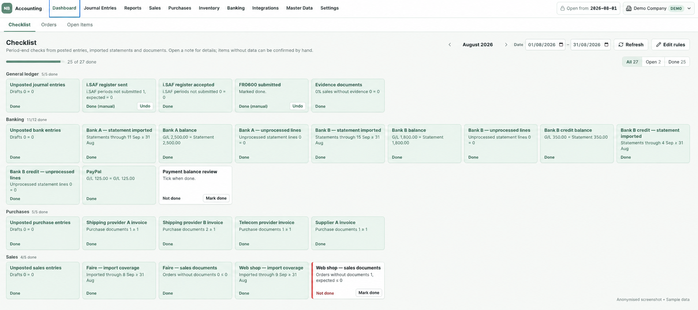
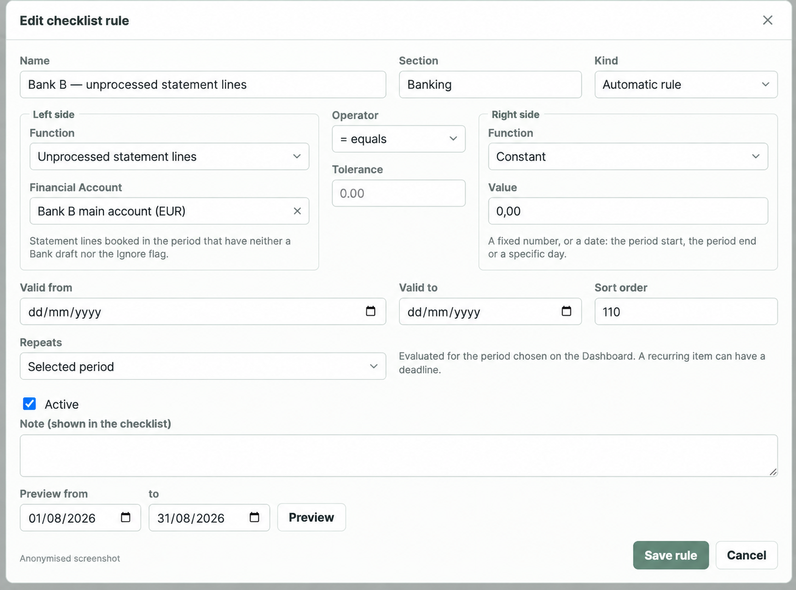
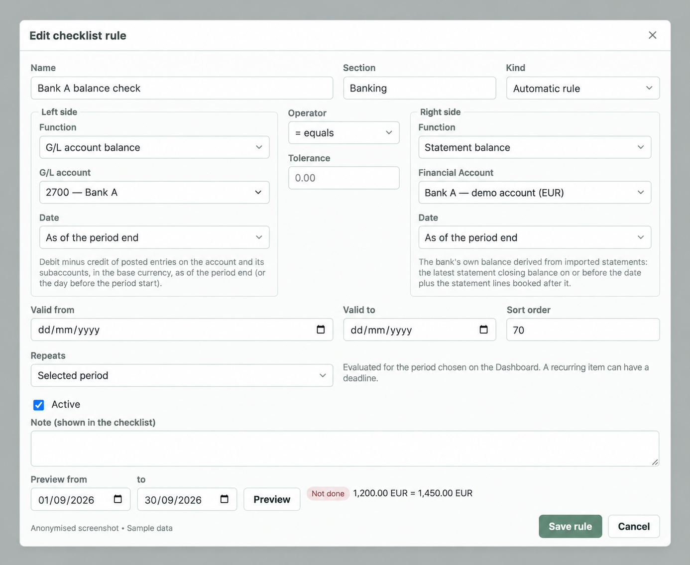

[Back to my portfolio](../../README.md)

# NB Accounting

## E-commerce bookkeeping built around rules, checklists and clear next actions

I started building NB Accounting to make my own bookkeeping faster and reduce reliance on paid integrations that covered only part of the workflow.

I work through accounting checklists, so I designed the system around that approach. The dashboard brings together period tasks, configurable checks and exceptions that need attention. It helps me see what is complete, where information is missing and which balances do not match.

My role is to define the requirements, accounting rules and user workflows, guide AI-assisted development, and test the system against my own working process.

**Status:** Personal application under active development, used locally. Source code is private.

## See the system

These application screenshots have been anonymised and translated for presentation. Company, supplier and account details have been replaced; financial amounts are sample data. The displayed rule logic and completion states are preserved.

### 1. Know what needs attention

The period checklist groups tasks across the general ledger, banking, purchases and sales. Automatic checks use posted entries, imported statements and documents. Manual tasks and confirmations are visibly distinguished.

In this example, an outstanding sales-document check and a manual payment-balance review remain open. A manually confirmed task still shows its automatic result, so the underlying exception stays visible.

### 2. Turn an accounting check into a configurable rule

A rule combines a data function, comparison operator and expected value. The user selects the account, period and tolerance, then previews the result before saving.

This rule checks that the selected account has **zero unprocessed statement lines**. It makes a recurring bookkeeping check explicit and repeatable.

### 3. Compare the ledger with the imported bank statement

The reconciliation rule compares the G/L account balance with the imported statement balance at the end of the selected period.

The sample balances are **EUR 1,200.00** and **EUR 1,450.00**. With zero tolerance, the equality check fails and the preview shows **Not done**. Missing input data produces an unknown result rather than a successful check.

## Connected workflows

| Area | Current scope |
|---|---|
| Marketplace imports | Etsy, WooCommerce and direct Faire imports, with source records available for review before accounting documents are posted. |
| Payment imports | PayPal and Stripe imports, reviewable statement records and matching workflows. |
| Purchase invoices | Rule-based extraction from text-based PDFs, field checks and duplicate detection before posting. Scanned invoices require manual entry. |
| Orders and inventory | Visibility of orders needing attention, internal stock tracking, marketplace SKU mapping and controlled stock-quantity updates to existing Faire listings. |
| Accounting | Organisation-specific configuration, sales and purchase documents, journal entries, bank operations and reports based on posted documents. |
| Period controls | Checks before closing a period, blocked posting into closed periods and controlled reopening of the latest closure. |

## Tax reporting workflows

| Workflow | Current scope |
|---|---|
| Lithuania — i.SAF | XML generation, file upload to VMI and processing-status tracking. Upload acceptance and final register submission are separate steps. |
| Union OSS | Quarterly calculations and report preparation. Direct submission to VMI is planned. |
| Germany — VAT | UStVA report preparation and ELSTER XML export for portal import. Filing is completed in the portal. |
| UK — VAT | Return preparation and an HMRC submission workflow. Return figures are entered or imported from CSV; they are not automatically calculated from the ledger. |

## Product decisions behind the screens

- **Checks should explain their result.** Show the values being compared, the selected period and missing inputs. Keep manual confirmation separate from the automatic result.
- **Imported data needs a review stage.** Resolve mappings and document issues before source records affect the posted ledger.
- **Rules should be configurable.** Account selection, tolerances, recurrence and deadlines belong to the user's accounting process.
- **Financial controls need clear boundaries.** Posting, period closure, payment-file validation and external submission are distinct steps with their own checks.

## How I develop and check it

I map the process and data relationships, define the required behaviour, compare the implemented result with that expectation and direct corrections. I use the application to investigate mismatches and refine rules, including duplicates, dates, currencies and correction paths. Automated tests support these functional checks.

**Technology:** Python, FastAPI, SQLAlchemy, PostgreSQL, Alembic, React, TypeScript and Docker Compose.

## A three-minute walkthrough

1. Open the period checklist and identify an unfinished check.
2. Open its rule and explain the source data, comparison and expected result.
3. Preview a balance mismatch and trace the records that need attention.

A walkthrough uses fictional organisations and transactions. External payment and tax submissions are not part of the demonstration.
