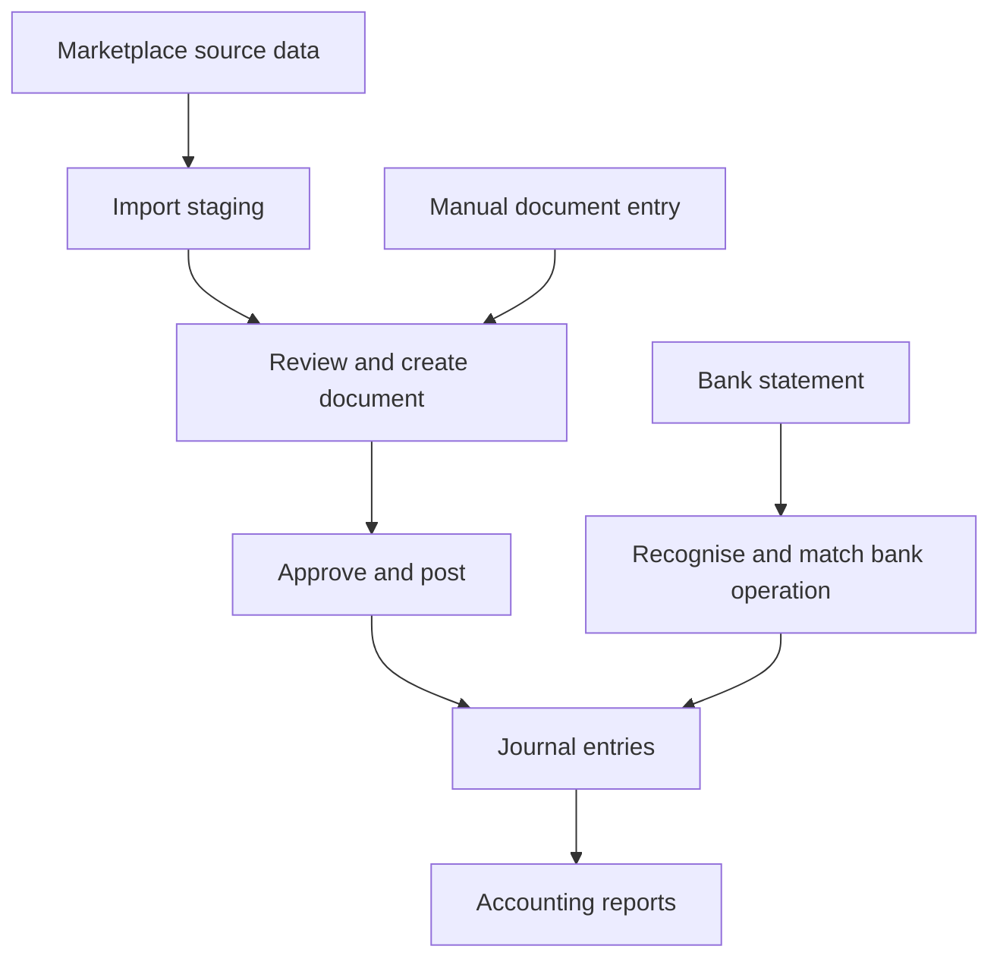

[Back to my portfolio](../../README.md)

# NB Accounting

## Accounting software built around the full transaction journey

I am developing NB Accounting as a personal application for multiple organisations, bookkeeping and marketplace operations. The idea comes from my experience in finance, ERP systems and e-commerce: a transaction rarely arrives as one clean record ready for the ledger. Orders, invoices, fees, refunds, payouts and bank entries need to be connected without losing their meaning.

I define the functional behaviour and data rules, set priorities, test the results and ask AI coding tools to implement or correct the code. This project lets me carry a requirement through to an application that I can inspect and improve.

**Status:** Personal application under active development, designed for local use. Source code is private.

## The problem I wanted to solve

Marketplace data, accounting documents and bank activity describe different parts of the same business process. Importing a record is not enough to determine how it should affect accounting. Organisation settings, document states, account mappings and dates all matter.

I wanted a workflow in which incoming data can be reviewed, transformed into an accounting document and posted under explicit rules. A user should be able to understand how a source transaction reached the journal and why an action is allowed or blocked.

## What the application includes

- **Organisation-specific configuration:** chart of accounts, VAT schemes, currencies, partners, bank accounts and document numbering.
- **Sales and purchase documents:** manual entry, approval and posting, with access to the resulting accounting entries.
- **Marketplace import workflows:** Etsy staging and WooCommerce API imports, including separate logical WooCommerce and Faire sources.
- **Banking and payments:** bank operations, balances, payment-file preparation and statement recognition.
- **Accounting reports:** general-ledger summary and account turnover, based on posted documents.

## A transaction's path through the system

*Workflow illustration. Import staging and accounting documents are separate parts of the process.*

## Product decisions and controls

**Imported data needs a review stage.** Source records stay separate from accounting documents. This gives the user a place to resolve mapping and data issues before the information affects the journal. Reports include posted documents.

**Closed periods need enforceable boundaries.** The application checks the posting date against the latest closed period. Period closure checks distinguish blocking draft records from warnings about unprocessed source data. Reopening follows a controlled sequence: only the latest closure can be reopened.

**Payment files need structured validation.** The application creates ISO 20022 pain.001 bank-payment XML. It checks mandatory values, positive amounts and identifier formats, calculates totals and validates the generated XML against its schema. File-format validation is one control in the payment workflow. It does not prove that a bank has accepted or executed a payment.

**Configuration should reflect the organisation.** Account selection, partners, tax mappings and document numbering must make sense for the organisation and transaction. I use actual workflow results to identify missing mappings or rules that need refinement.

## Concrete acceptance examples

| Scenario | Expected behaviour implemented in the application |
|---|---|
| A marketplace record has been imported but no accounting document has been posted | Keep it outside posted accounting reports. |
| A user tries to post into a closed period | Reject the posting rather than silently changing the closed period. |
| Draft accounting records remain within the period being closed | Report the blockers and prevent closure. |
| A payment contains a zero amount or fails the supported format checks | Reject the export and identify the validation problem. |
| A user tries to reopen an older closure while a newer one remains closed | Reject the action and preserve the required reopening sequence. |

## How I develop and check it

I trace the process across source data, documents, accounting entries and bank operations. I describe the required behaviour, compare the implemented result with that expectation and direct corrections. I pay particular attention to duplicates, partial refunds, dates, currency handling and correction paths.

The repository includes automated tests for business rules and technical validation. I treat those tests as support for functional checks. The project continues to evolve and is not presented as a certified or production-ready accounting service.

**Technology:** Python, FastAPI, SQLAlchemy, PostgreSQL, Alembic, React, TypeScript and Docker Compose.

## A three-minute demonstration

1. Start with a prepared source record and explain what needs review before creating an accounting document.
2. Open a document and trace its posted entries into the ledger.
3. Demonstrate a rejected action, such as posting into a closed period, and explain the acceptance rule behind it.

An external walkthrough would use fictional organisations and transactions. Live bank, marketplace and tax submissions are outside that demonstration.
